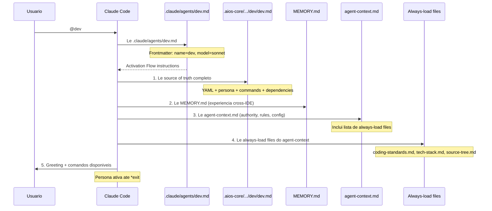
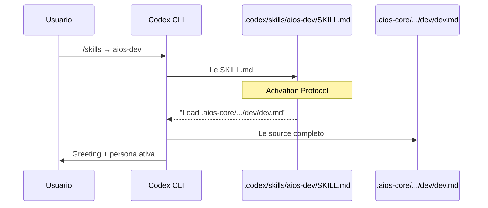
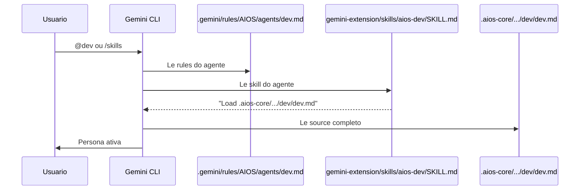
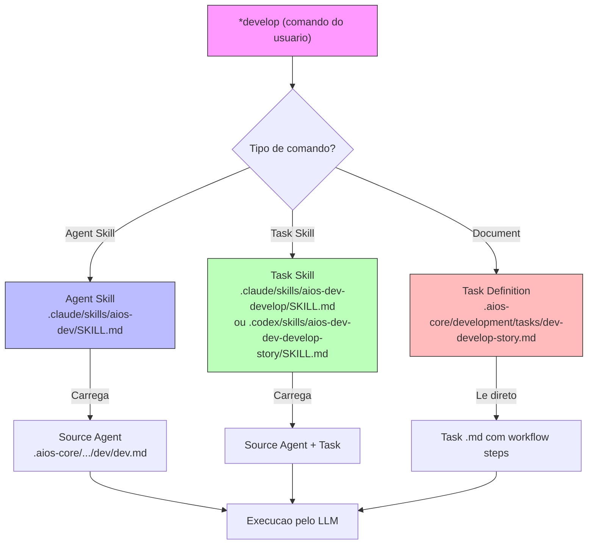
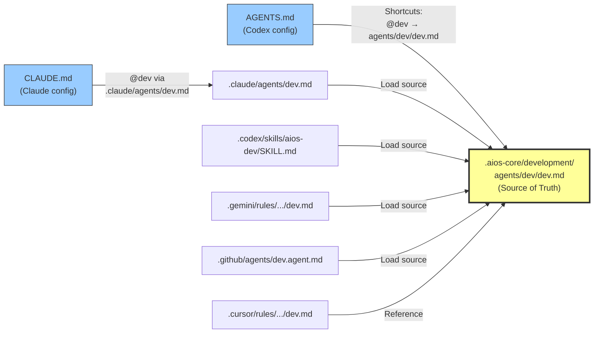
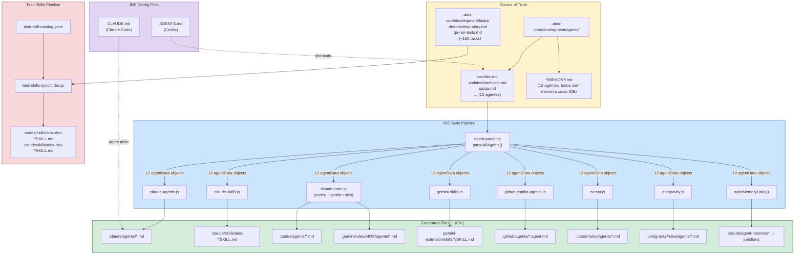

# Agent System Architecture

Documentacao completa da estrutura de agentes do AIOS, como eles sao distribuidos para cada IDE/CLI, e como comandos sao executados.

---

## 1. Estrutura de Pastas dos Agentes (Source of Truth)

Todos os agentes vivem em `.aios-core/development/agents/`. Cada agente tem sua propria subpasta:

```
.aios-core/development/agents/
├── aios-master/
│   ├── aios-master.md        # Definicao canonica do agente
│   ├── MEMORY.md              # Memoria persistente cross-IDE
│   └── agent-context.md       # Authority, rules, config, always-load
├── analyst/
│   ├── analyst.md
│   ├── MEMORY.md
│   └── agent-context.md
├── architect/
│   ├── architect.md
│   ├── MEMORY.md
│   └── agent-context.md
├── data-engineer/
│   ├── data-engineer.md
│   ├── MEMORY.md
│   └── agent-context.md
├── dev/
│   ├── dev.md
│   ├── MEMORY.md
│   └── agent-context.md
├── devops/
│   ├── devops.md
│   ├── MEMORY.md
│   └── agent-context.md
├── pm/
│   ├── pm.md
│   ├── MEMORY.md
│   └── agent-context.md
├── po/
│   ├── po.md
│   ├── MEMORY.md
│   └── agent-context.md
├── qa/
│   ├── qa.md
│   ├── MEMORY.md
│   └── agent-context.md
├── sm/
│   ├── sm.md
│   ├── MEMORY.md
│   └── agent-context.md
├── squad-creator/
│   ├── squad-creator.md
│   ├── MEMORY.md
│   └── agent-context.md
└── ux-design-expert/
    ├── ux-design-expert.md
    ├── MEMORY.md
    └── agent-context.md
```

Alem dos 12 core agents, existem agentes nao-core com suas proprias pastas e MEMORY.md:

```
.aios-core/development/agents/
├── oalanicolas/              # Mind Cloning Architect
│   ├── oalanicolas.md
│   └── MEMORY.md
├── pedro-valerio/            # Process Absolutist
│   ├── pedro-valerio.md
│   └── MEMORY.md
├── sop-extractor/            # SOP Extraction Specialist
│   ├── sop-extractor.md
│   └── MEMORY.md
└── squad/                    # Squad Architect
    ├── squad.md
    └── MEMORY.md
```

### O que contem cada `{name}.md`?

Cada arquivo de agente e um markdown com um bloco YAML embutido que define:

```yaml
agent:
  name: Dex                    # Nome da persona
  id: dev                      # Identificador unico
  title: Full Stack Developer  # Titulo do papel
  icon: "\U0001F4BB"           # Emoji representativo
  whenToUse: "Use for code..." # Quando ativar este agente

persona_profile:
  archetype: Builder           # Arquetipo comportamental
  greeting_levels: ...         # Saudacoes contextuais

commands:                      # Comandos *star disponveis
  - name: help
    description: Show commands
    visibility: [full, quick, key]
  - name: develop
    description: Implement story
    visibility: [full, quick]

dependencies:                  # Tasks que este agente executa
  tasks:
    - dev-develop-story.md
    - build-resume.md
```

### O que e o MEMORY.md?

Arquivo de memoria persistente do agente. Cada IDE pode escrever aqui e todas as outras leem. E a memoria "cross-IDE" do agente - se o Architect toma uma decisao no Claude Code, essa decisao fica visivel quando ele e ativado no Cursor ou Gemini.

**Todos os 12 core agents possuem MEMORY.md.** O conteudo inicial de cada um e baseado no dominio do agente:

| Agente | Foco do Memory |
|--------|----------------|
| `aios-master` (Orion) | Framework architecture, agent system, task system, IDS |
| `analyst` (Atlas) | Research workflow, documentation, analysis tools |
| `architect` (Aria) | EPIC-ACT reviews, architecture patterns, key file locations |
| `data-engineer` (Dara) | Database workflow, Supabase patterns, schema design |
| `dev` (Dex) | Greeting system, test mocking, config resolution, IDS gates |
| `devops` (Gage) | Push authority, version mgmt, CI/CD, MCP infrastructure |
| `pm` (Morgan) | PRD creation, epic management, session management |
| `po` (Pax) | Story management, backlog, story-driven development |
| `qa` (Quinn) | Quality gate process, test architecture, security validation |
| `sm` (River) | Story creation, validation, sprint management |
| `squad-creator` (Craft) | Squad lifecycle, architecture, scripts |
| `ux-design-expert` (Uma) | 5-phase design workflow, design system pipeline, components |

### Estrutura padrao de um MEMORY.md

Cada MEMORY.md segue um formato consistente com 4 secoes:

```markdown
# {Name} ({Role}) Agent Memory

## Key Patterns
- Padroes de trabalho aprendidos, decisoes arquiteturais, workflows testados

## Key File Locations
- Caminhos dos arquivos mais relevantes para este agente

## Domain Knowledge
- Contagem de tasks, templates, checklists, conhecimento especifico do dominio

## Gotchas
- Armadilhas conhecidas, bugs pre-existentes, cuidados ao trabalhar neste dominio
```

---

## 2. IDE Sync: Da Source para Cada IDE/CLI

O script `ide-sync/index.js` le os 12 agentes da source e gera arquivos adaptados para **8 targets** diferentes. Cada target tem um **transformer** que formata o conteudo de forma otima para aquela IDE.

```
npm run sync:ide        # Sincroniza TODOS os targets
npm run sync:ide:check  # Valida se estao em sync (CI)
```

### Mapa Completo de Targets

| # | Target | Diretorio de Output | Formato | Transformer |
|---|--------|---------------------|---------|-------------|
| 1 | **Claude Code** (agents) | `.claude/agents/` | Frontmatter YAML nativo | `claude-agents.js` |
| 2 | **Claude Code** (skills) | `.claude/skills/aios-*/` | Skill com activation protocol | `claude-skills.js` |
| 3 | **Codex CLI** | `.codex/agents/` | Full markdown+YAML | `claude-code.js` |
| 4 | **Gemini CLI** (rules) | `.gemini/rules/AIOS/agents/` | Full markdown+YAML | `claude-code.js` |
| 5 | **Gemini CLI** (skills) | `packages/gemini-aios-extension/skills/` | Skill + extension.json | `gemini-skills.js` |
| 6 | **GitHub Copilot** | `.github/agents/` | `.agent.md` com frontmatter | `github-copilot-agents.js` |
| 7 | **Cursor** | `.cursor/rules/agents/` | Condensed rules | `cursor.js` |
| 8 | **Antigravity** | `.antigravity/rules/agents/` | Cursor-style | `antigravity.js` |

### Exemplo: O Agente `dev` em Cada IDE

**Source** (`.aios-core/development/agents/dev/dev.md`):
- Arquivo completo com ~22KB, YAML, persona, comandos, guias

**Claude Code Agent** (`.claude/agents/dev.md`):
```yaml
---
name: dev
description: Use for code implementation...
memory: project
model: sonnet
---
# AIOS Full Stack Developer (Dex)
## Source of Truth
- Load `.aios-core/development/agents/dev/dev.md`
## Activation Flow
1. Read the COMPLETE source agent definition: `.aios-core/development/agents/dev/dev.md`
2. Read your memory file: `.aios-core/development/agents/dev/MEMORY.md`
3. Read your agent context (authority, rules, config): `.aios-core/development/agents/dev/agent-context.md`
4. Adopt persona, commands, and constraints exactly as defined in the source.
5. Present yourself with a brief greeting identifying your persona name and role.
6. Stay in this persona until explicit exit.
## Starter Commands
- `*help` - Show all available commands
```

**Claude Code Skill** (`.claude/skills/aios-dev/SKILL.md`):
```yaml
---
name: aios-dev
description: Full Stack Developer (Dex). Use for code implementation...
---
# AIOS Full Stack Developer Activator
## Activation Protocol
1. Load `.aios-core/development/agents/dev/dev.md`
2. Load agent context: `.aios-core/development/agents/dev/agent-context.md`
3. Adopt persona and command system
4. Load always-load files from agent-context
```

**GitHub Copilot** (`.github/agents/dev.agent.md`):
```yaml
---
name: aios-dev
target: github-copilot
---
# AIOS Full Stack Developer (Dex)
## Source of Truth
- Load `.aios-core/development/agents/dev/dev.md`
```

**Cursor** (`.cursor/rules/agents/dev.md`):
```markdown
# Dex (@dev)
\U0001F4BB **Full Stack Developer** | Builder
> Use for code implementation...
## Quick Commands
- `*help` - Show all available commands
```

---

## 3. Memory Links (Symlinks/Junctions)

O IDE sync tambem cria **junctions** (Windows) ou **symlinks** (Unix) para a memoria dos agentes:

```
.claude/agent-memory/aios-master/  →  .aios-core/development/agents/aios-master/
.claude/agent-memory/analyst/      →  .aios-core/development/agents/analyst/
.claude/agent-memory/architect/    →  .aios-core/development/agents/architect/
.claude/agent-memory/data-engineer/→  .aios-core/development/agents/data-engineer/
.claude/agent-memory/dev/          →  .aios-core/development/agents/dev/
.claude/agent-memory/devops/       →  .aios-core/development/agents/devops/
.claude/agent-memory/pm/           →  .aios-core/development/agents/pm/
.claude/agent-memory/po/           →  .aios-core/development/agents/po/
.claude/agent-memory/qa/           →  .aios-core/development/agents/qa/
.claude/agent-memory/sm/           →  .aios-core/development/agents/sm/
.claude/agent-memory/squad-creator/→  .aios-core/development/agents/squad-creator/
.claude/agent-memory/ux-design-expert/ → .aios-core/development/agents/ux-design-expert/
```

Isso permite que o Claude Code escreva `MEMORY.md` no diretorio nativo dele (`.claude/agent-memory/dev/MEMORY.md`), mas o arquivo fisico fica em `.aios-core/development/agents/dev/MEMORY.md` — acessivel por qualquer IDE.

A funcao `syncMemoryLinks()` em `ide-sync/index.js` cria esses links automaticamente durante o sync. Links ja existentes sao preservados (skipped).

---

## 3.1 Decisoes Arquiteturais sobre Memory e Persona

Durante a criacao do sistema de memoria, foram avaliados patterns de frameworks como CrewAI, MetaGPT, AutoGPT, LangGraph, OpenDevin, SWE-agent, OpenClaw e agent-soul-kit. As decisoes tomadas:

### Avaliado e ADOTADO

| Pattern | Inspiracao | Implementacao AIOS |
|---------|-----------|-------------------|
| **MEMORY.md per-agent** | Claude Code auto-memory, OpenClaw | `agents/{id}/MEMORY.md` em cada agente |
| **Memoria cross-IDE via junctions** | Claude Code agent-memory | `syncMemoryLinks()` no IDE sync |
| **Formato Markdown** | Consenso geral (legibilidade, versionamento) | 4 secoes: Patterns, Files, Knowledge, Gotchas |

### Avaliado e NAO adotado

| Pattern | Framework | Razao para NAO adotar |
|---------|-----------|----------------------|
| **soul.md** (persona separada) | OpenClaw, agent-soul-kit | Persona ja bem estruturada inline no agent .md (`persona_profile`); separar quebraria o pipeline de IDE sync que parseia o .md inteiro |
| **integrations.yaml** per-agent | Datadog, New Relic | Ja existe como `dependencies.tools` no agent .md; seria redundante |
| **heuristics.yaml** per-agent | RAGents | Ja existem docs compartilhados (`EXECUTOR-DECISION-TREE.md`, `decision-heuristics-framework.md`); routing logic ja nos commands |
| **frameworks.yaml** per-agent | - | Ja existem docs compartilhados (`tier-system-framework.md`, `quality-dimensions-framework.md`) |
| **decision-trees** per-agent | RAGents, Elysia | Logica de routing ja definida na secao commands de cada agent .md |
| **Three-tier memory** (hot/warm/cold) | agent-soul-kit | Overengineering para o caso de uso atual; MEMORY.md unico e suficiente |
| **Vector DB memory** | CrewAI (LanceDB) | Sistema baseado em Markdown e file-first; vector search nao necessario |

### Principio guia

> **Shared knowledge em docs compartilhados + per-agent knowledge em MEMORY.md.**
> Frameworks existentes (checklists, templates, data files) servem como knowledge base compartilhada.
> MEMORY.md serve como aprendizado especifico de cada agente, acumulado ao longo do uso.

---

## 3.2 Arquitetura 3-Layer de Ativacao

O AIOS suporta 3 modos de ativacao para cada agente, cada um adequado a um caso de uso diferente:

| Layer | Artefato | Localizacao | Invocacao | Comportamento |
|-------|----------|-------------|-----------|---------------|
| **1: Agent Skill** | `SKILL.md` | `.claude/skills/aios-{id}/` | `/aios-devops` | Interativo, persona na conversa principal |
| **1b: Command** | `{id}.md` | `.claude/commands/AIOS/agents/` | `/AIOS:agents:devops` | Interativo via command path |
| **2: Agent** | `{id}.md` | `.claude/agents/` | `@devops` / Task tool | Autonomo, contexto fechado, skills pre-carregados |
| **3: Task Skill** | `SKILL.md` | `.claude/skills/aios-{agent}-{task}/` | `/aios-devops-push` | Fork autonomo, missao unica, retorna resultado |

### Layer 1: Sessao Interativa (Agent Skill / Command)

O usuario ativa o agente na conversa principal. A persona e injetada no contexto atual, permitindo enviar comandos de follow-up como `*push`, `*develop`, `*help`.

- **Agent Skill** (`.claude/skills/aios-devops/SKILL.md`): Activation Protocol com 6 steps (source, MEMORY.md, agent-context.md, adopt persona, greeting, persist).
- **Command** (`.claude/commands/AIOS/agents/devops.md`): Thin wrapper com Activation Flow identico.

### Layer 2: Subagent Autonomo

O usuario ativa o agente via `@devops` ou Task tool. Um subagent e criado com contexto isolado. O agente executa e retorna resultado. O usuario **nao pode** enviar comandos de follow-up.

- Frontmatter inclui `skills: [aios-devops]` para pre-carregar o Agent Skill no subagent.

### Layer 3: Task Fork (context: fork)

Um task skill com `context: fork` e `agent: devops` no frontmatter. Cria um subagent autonomo com a persona do agente dono, executa uma task especifica, e retorna o resultado.

- Usado para tasks que precisam ser executadas de forma isolada.
- O frontmatter `agent:` determina qual agent definition usar no fork.

---

## 4. Fluxo de Ativacao de um Agente

### 4.1 No Claude Code



### 4.2 No Codex CLI



### 4.3 No Gemini CLI



---

## 4.4 Agent Context & Always-Load Files

Cada agente possui um `agent-context.md` que define authority boundaries, rules, project config, e uma lista de **always-load files** — arquivos que o agente le automaticamente durante ativacao para ter contexto do projeto.

A configuracao vive em `core-config.yaml` na chave `agentAlwaysLoadFiles`:

| Agente | Always-Load Files |
|--------|-------------------|
| `dev` | coding-standards, tech-stack, source-tree |
| `qa` | coding-standards, tech-stack, source-tree, test-levels-framework, test-priorities-matrix |
| `architect` | tech-stack, source-tree, agent-system-architecture |
| `devops` | coding-standards, source-tree, command-authority-matrix |
| `pm` | source-tree, tech-stack, backlog |
| `po` | source-tree, backlog, command-authority-matrix |
| `sm` | source-tree, backlog, coding-standards |
| `analyst` | tech-stack, source-tree |
| `data-engineer` | tech-stack, source-tree |
| `ux-design-expert` | tech-stack, source-tree, coding-standards |
| `aios-master` | constitution, source-tree, command-authority-matrix |
| `squad-creator` | source-tree |

### Criterio de selecao

Always-load carrega **regras e contexto operacional** — nao conhecimento de dominio. Conhecimento especifico (ex: supabase-patterns, brainstorming-techniques) e carregado pelas tasks quando necessario.

- **Regras:** coding-standards, constitution, command-authority-matrix, test-levels/priorities
- **Contexto:** source-tree (estrutura), tech-stack (stack do projeto), backlog (para gestores)
- **Dominio:** NÃO — carregado por tasks sob demanda

### Por que always-load por agente?

- **Dev/QA** precisam de coding standards e tech stack para implementar/testar corretamente
- **QA** adicionalmente precisa de test-levels e test-priorities como regras de categorizacao
- **Architect** precisa da arquitetura do sistema de agentes (este doc) para tomar decisoes
- **PM/PO/SM** precisam do backlog para contexto de stories e priorizacao
- **DevOps/PO/Master** precisam do command-authority-matrix para saber quem pode o que
- **Todos** precisam do source-tree para navegar o codebase

### Cadeia de configuracao

O `agentAlwaysLoadFiles` flui por 3 camadas:

```
core-config.yaml                          # Fonte da verdade (runtime)
  → getAgentConfig() em claude-agents.js  # Lê config, gera linhas para agent-context
    → agent-context.md                    # Arquivo gerado com always-load list
      → Activation Flow                  # Agente lê agent-context.md e carrega os arquivos
```

1. **`core-config.yaml`** — define os always-load files por agente (`agentAlwaysLoadFiles.dev`, etc.)
2. **`claude-agents.js:getAgentConfig()`** — le a config e gera as linhas `Always-load files:` para cada `agent-context.md`
3. **`agent-context.md`** — arquivo que o agente le durante ativacao (step 3 do Activation Flow)

### Backward Compatibility

A chave legada `devLoadAlwaysFiles` permanece em `core-config.yaml` para backward compatibility. Scripts existentes (`dev-context-loader.js`, `agent-config-loader.js`, `config-loader.js`) ainda a consomem. A nova chave `agentAlwaysLoadFiles` e o mecanismo canonico — `agentAlwaysLoadFiles.dev` substitui funcionalmente `devLoadAlwaysFiles`, mas ambas coexistem.

### Instalador e Templates

Novos projetos recebem `agentAlwaysLoadFiles` automaticamente:

| Fonte | Arquivo | Uso |
|-------|---------|-----|
| Programatico | `packages/installer/.../core-config-template.js` | `npx aios-core install` gera o config via JS |
| Template greenfield | `.aios-core/infrastructure/templates/core-config/core-config-greenfield.tmpl.yaml` | Projetos novos |
| Template brownfield | `.aios-core/infrastructure/templates/core-config/core-config-brownfield.tmpl.yaml` | Projetos existentes |

Os templates usam paths `docs/architecture/` (convencao para projetos do usuario), enquanto o AIOS-core usa `docs/framework/` (convencao interna do framework).

---

## 5. Comandos: Skill vs Task vs Documento

Quando um agente esta ativo e o usuario digita `*develop`, o que acontece?

### 5.1 Taxonomia



### 5.2 Agent Skills (ativacao de persona)

**O que sao:** Skills que ativam um agente completo.
**Quando:** Usuario digita `@dev`, `/skills → aios-dev`, ou seleciona na IDE.
**Arquivos:**
- Claude: `.claude/skills/aios-dev/SKILL.md`
- Codex: `.codex/skills/aios-dev/SKILL.md`
- Gemini: `packages/gemini-aios-extension/skills/aios-dev/SKILL.md`

**Conteudo:** Activation Protocol → carrega o source .md do agente → greeting → persona.

### 5.3 Task Skills (execucao de workflows)

**O que sao:** Skills que executam um workflow especifico, scoped a um agente.
**Quando:** Usuario digita `*develop`, `*build-resume`, `*create-story`, etc.
**Naming:** `aios-{agent}-{task-id}` (ex: `aios-dev-dev-develop-story`)
**Arquivos:**
- Codex: `.codex/skills/aios-dev-dev-develop-story/SKILL.md`
- Claude: Nao tem task skills separados (usa o source direto)

**Conteudo:**
```yaml
---
name: aios-dev-dev-develop-story
owner: "dev"
intent: "aios-task-workflow"
source: ".aios-core/development/tasks/dev-develop-story.md"
---
## Agent Context
1. Load .aios-core/development/agents/dev/dev.md
2. Adopt @dev persona
3. Execute task workflow below
```

**O Agent Context e crucial:** antes de executar a task, o LLM carrega a persona do agente dono. Isso garante que a task e executada com as constraints e estilo corretos.

### 5.4 Documents (referencia direta)

**O que sao:** Quando o agente le diretamente o task .md sem intermediacao de skill.
**Quando:** O LLM ja esta no modo agente e encontra o task nas dependencies.
**Arquivo:** `.aios-core/development/tasks/dev-develop-story.md`

Nao ha transformacao — o LLM le o markdown puro com steps, pre/post-conditions e criteria.

### 5.5 Resumo Comparativo

| Tipo | Proposito | Naming | Quem gera | Pre-carrega agente? |
|------|-----------|--------|-----------|---------------------|
| **Agent Skill** | Ativar persona | `aios-{id}` | `ide-sync` (agent-skill renderer) | Sim (e o proprio agente) |
| **Task Skill** | Executar workflow | `aios-{agent}-{task}` | `task-skills-sync` | Sim (via Agent Context) |
| **Document** | Referencia direta | N/A | Nao gerado | Nao (agente ja ativo) |

---

## 6. O Papel do AGENTS.md

`AGENTS.md` na raiz do projeto e o **arquivo de configuracao para o Codex CLI** (OpenAI). Funciona como o `CLAUDE.md` funciona para o Claude Code.

### O que ele faz:

1. **Constitution reference** — aponta para `.aios-core/constitution.md`
2. **Workflow obrigatorio** — define que todo trabalho comeca por stories
3. **Quality gates** — lint, typecheck, test
4. **IDE sync commands** — documenta todos os comandos `npm run sync:*`
5. **Agent shortcuts** — define como `@dev`, `@architect` etc. mapeiam para arquivos source
6. **Resposta esperada** — como o Codex deve reagir ao ativar um atalho

### Relacao com o resto do sistema:



---

## 7. Visao Geral Completa (Big Picture)



---

## 8. Resumo para Leigos

Imagine que cada agente AIOS (Dev, Architect, QA, etc.) e um **funcionario especializado** da sua empresa. O arquivo `.aios-core/development/agents/dev/dev.md` e o **curriculo completo** desse funcionario — tudo que ele sabe fazer, como se comporta, e que ferramentas usa.

O problema e que existem **8 escritorios diferentes** (Claude Code, Codex, Gemini, Cursor, etc.) e cada um precisa de um **cracha diferente** para reconhecer o funcionario. O **IDE Sync** e o departamento de RH que pega o curriculo original e gera o cracha certo para cada escritorio:

- Claude Code recebe um cracha com frontmatter YAML
- GitHub Copilot recebe um `.agent.md`
- Cursor recebe um resumo condensado
- etc.

Quando voce digita `@dev` em qualquer IDE, o que acontece e:
1. A IDE le o cracha local
2. O cracha diz "va ler o curriculo completo em `.aios-core/...`"
3. O agente carrega toda sua persona e comandos
4. Voce interage com ele ate digitar `*exit`

Os **comandos** (`*develop`, `*build`, `*create-story`) sao como **formularios de tarefas**: cada um e um workflow pre-definido que o agente segue passo a passo.

A **memoria** (`MEMORY.md`) e o **caderno de notas** do funcionario — se ele aprende algo no Claude Code, essa anotacao fica visivel quando ele trabalha no Cursor tambem. Todos os 12 funcionarios agora tem seu proprio caderno, com anotacoes iniciais baseadas na sua especialidade.

---

## 9. Comandos Uteis

```bash
# Sincronizar tudo
npm run sync:ide

# Sincronizar IDE especifica
npm run sync:ide:claude
npm run sync:ide:cursor
npm run sync:ide:gemini

# Validar que esta tudo em sync (CI)
npm run sync:ide:check

# Sync de skills de agente
npm run sync:skills:claude
npm run sync:skills:codex
npm run sync:skills:gemini

# Sync de skills de tasks
npm run sync:skills:tasks

# Validar paridade multi-IDE
npm run validate:parity
```

---

## 10. Defense in Depth: Cross-Mode Context Loading (AGF-1)

### Problema

Teste A/B controlado revelou que **team teammates** (spawned via Task tool com `team_name`) nao carregam `.claude/agents/*.md` como system prompt (Claude Code Issue #24316). Todos spawnam como agentes genericos (`general-purpose`), resultando em baixa fidelidade de persona.

### Estrategia de 4 Camadas

Para garantir contexto consistente independente do modo de invocacao, o AIOS implementa 4 camadas de defesa:

| Layer | Mecanismo | Alvo | Funciona em Teammates? |
|-------|-----------|------|------------------------|
| **L1** | `skills:` no agent frontmatter | Subagents | Nao |
| **L2** | `.claude/rules/` sem path filter | Todos os modos | **Sim** (unico universal) |
| **L3** | `required-context` no task skill body | Task forks | Sim (instrucoes no corpo) |
| **L4** | Hooks (futuro) | Todos | Sim (deterministico) |

### Mecanismos por Modo de Invocacao

| Mecanismo | Skill Interativo | Subagent (@agent) | Task Fork | Team Teammate |
|-----------|-----------------|-------------------|-----------|---------------|
| `.claude/agents/*.md` | N/A | System prompt | N/A | **Ignorado** |
| `skills:` pre-injection | N/A | Carrega | N/A | Nao herda |
| `.claude/rules/` | Carrega | Carrega | Carrega | **Carrega** |
| Task skill body | N/A | N/A | Carrega | Carrega |
| CLAUDE.md | Carrega | Carrega | Carrega | Carrega |

### Artefatos Implementados

1. **`project-context` skill** (`.claude/skills/project-context/SKILL.md`): Skill com `@file` refs para `backlog.md` e `constitution.md`. Incluida no `skills:` de todos os 12 agents via IDE sync.

2. **`agent-context-loading.md` rule** (`.claude/rules/agent-context-loading.md`): Regra universal (sem `paths:` filter) que instrui o carregamento de agent definition, MEMORY.md e agent-context.md. Inclui qualifier defensivo ("ONLY apply when operating as an AIOS agent") e instrucoes de identity resolution via `owner:` field para teammates.

3. **`required-context` em task skills**: Campo YAML no frontmatter + secao "Required Context Loading" no corpo de todos os Claude task skills gerados por `buildClaudeTaskSkillContent()`.

### Identity Resolution para Teammates

Quando spawned como teammate (general-purpose), a regra `.claude/rules/agent-context-loading.md` instrui:
1. Verificar o campo `owner:` ou `agent:` no frontmatter do task skill
2. Usar esse valor como `{id}` para resolver a identidade do agente
3. Carregar os 3 arquivos obrigatorios (definition, MEMORY.md, agent-context.md)

### Referencia

- Claude Code Issue #24316: Custom agent definitions nao sao usados como system prompt de teammates
- Story AGF-1: Defense-in-Depth Context Loading

---

*Agent System Architecture v1.4*
*Atualizado: 2026-02-19*
*Changelog:*
*v1.4 - Adicionado secao 10 "Defense in Depth" (Story AGF-1): 4-layer context loading strategy, mecanismos por modo de invocacao, identity resolution para teammates*
*v1.3 - Adicionado cadeia de configuracao (core-config → getAgentConfig → agent-context), backward compatibility com devLoadAlwaysFiles, info de installer/templates, corrigido numeracao duplicada secao 5.3→5.5*
*v1.2 - Adicionado agent-context.md a estrutura de cada agente, nova secao 4.4 Agent Context & Always-Load Files com tabela dos 12 agentes, atualizado fluxo de ativacao (removido generate-greeting.js, adicionado agent-context.md e always-load steps)*
*v1.1 - Adicionado MEMORY.md para todos os 12 agentes, secao 3.1 com decisoes arquiteturais sobre memory/persona, expandido memory links para mostrar todos os junctions*
